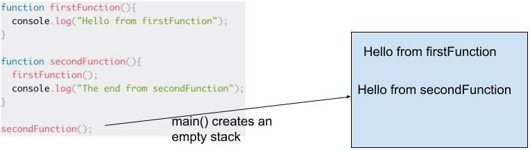

# Class 10 Reading Notes

**Understanding the JavaScript Call Stack**  
1\. A function invocation  
2\. One  
3\. Last in first out principle  
4\.  -
  
5\. Basically when you have a looping function with no end, called a recursive function with no exit point  
/\/\/\/\/\/\/\/\/\/\/\/\/\/\/\/\/\/\  
**JS error messages**  
1\. When you try to use a variable that is not yet declared  
2\. When you have something that cannot be parsed in terms of syntax, I believe this means when it's not correctly written  
3\. when you have something and give it an invalid length  
4\. when the types you are trying to use are incompatible  
5\. a certain part of your code that stops the JS execution  
6\. stops the execution on js and calls the debugging function if you wrote one  
