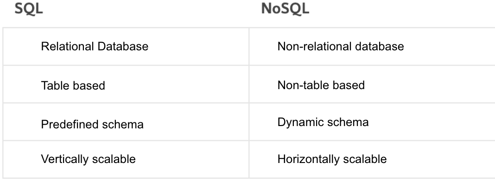

# Class 11 Reading Notes

**nosql vs sql**  
  
1\. structured data  
2\. [Structured Data](https://developers.google.com/search/docs/appearance/structured-data/intro-structured-data#:~:text=Structured%20data%20is%20a%20standardized,the%20calories%2C%20and%20so%20on.) "is a standardized format for providing info about a page and classifying the page content; for example, on a recipe page, what are the ingredients, the cooking time and the temperature, the calories, and so on.  
3\. structure, semi-structured, and unstructured data in one DB  
4\. weather data, video, audio, etc.  
5\. NoSQL  
6\. NoSQL  

**sql vs nosql (Video)**  
1\. structured query language  
2\. a database that works in a certain way and supports sql  
3\. tables, rows, columns  
4\. defines how data is organized  
5\. a "not only SQL" database, meaning it can store data differently than just tables  
6\. they store data in documents rather than relational tables  
7\. it stores collections of documents  
8\. Mongo, it ensures high and diverse data availability, its faster, and more scalable  
9\. they don't support ACID (atomicity, consistency, isolation, durability)  
